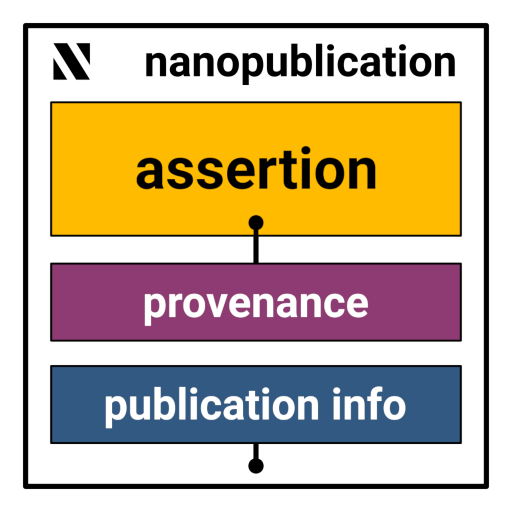

# What are nanopublications?

Nanopublications are a formalized and machine-readable way of communicating the smallest possible units of publishable
information. This could be, for example, the outcome of a scientific study or a claim
made by a particular scientist.

Nanopublications are searchable, citable, and contain authorship and attribution information. The aim is to encourage
individual scientific results to be released in a traceable and interoperable format. As such, nanopublications are an
effective [FAIR](https://www.go-fair.org/fair-principles/) means of communicating scientific claims and results.

As can be seen in this image, a nanopublication has three basic elements:

1. Assertion: The assertion is the main content of a nanopublication in the form of a small atomic unit of information
2. Provenance: This part describes how the assertion above came to be. This can include the scientific methods that were
   used to generate the assertion, for example a reference to the kind of study that was performed and its parameters.
3. Publication Info:  This part contains metadata about the nanopublication as a whole, such as when and by whom it was
   created and the license terms for its reuse.